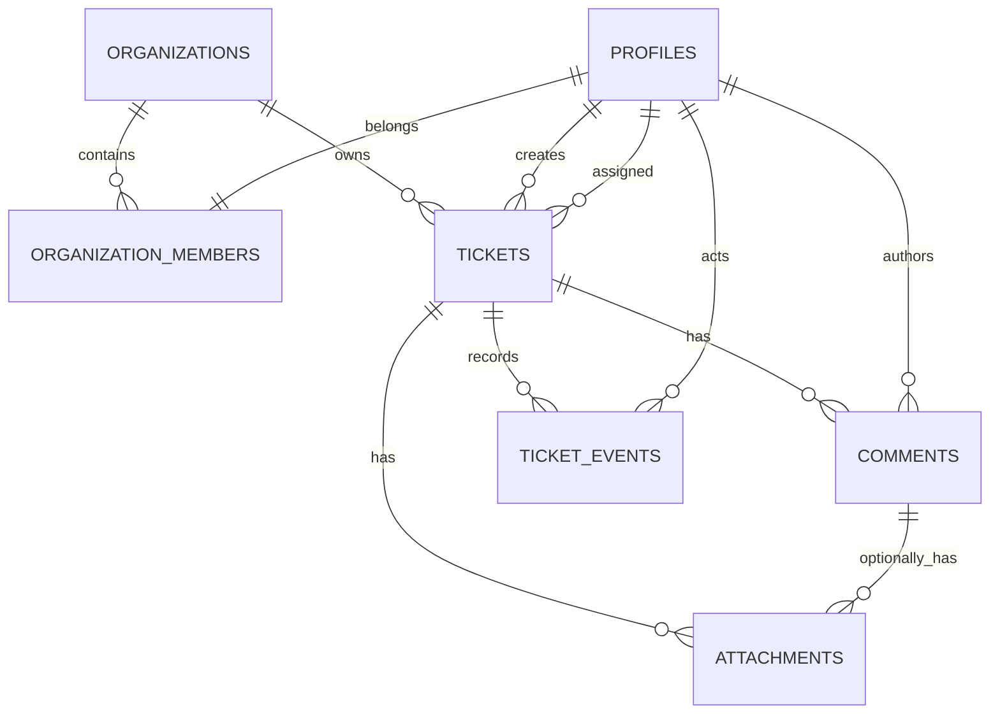

# Database

## Relationships

## Tables

- `organizations`: tenant identity and unique slug.
- `profiles`: public application name linked one-to-one to `auth.users`.
- `organization_members`: one active organization and one role per user.
- `tickets`: workflow, category, priority, assignment, and SLA timestamps.
- `comments`: ticket conversation records.
- `attachments`: private Storage object metadata.
- `ticket_events`: focused assignment, priority, and workflow history.

All primary keys are UUIDs and all application timestamps are `timestamptz`.

## Constraints and indexes

Check constraints enforce role, status, category, priority, lengths, MIME types, and 5 MB size. Unique constraints enforce one organization per user and unique storage paths. Foreign keys use cascades only where a child has no meaning without its parent.

Indexes cover tenant IDs, foreign keys, status, priority, category, assignment, creator, and recency. A composite organization/status/created index supports dashboard and list queries.

## Functions

Identity helpers resolve current organization/role and ticket/profile access. Workflow RPCs create tickets, assign agents, change status/priority, add comments, record attachments, and aggregate dashboard data. Security-definer functions use an empty explicit `search_path`, fully-qualified relations, role/tenant checks, and limited grants.

## Migrations

1. `20260714180000_supportflow_core.sql`: schema, constraints, indexes, helpers, RLS, RPCs, Storage, and initial Realtime setup.
2. `20260714181500_security_and_indexes.sql`: advisor-driven trigger permission hardening and remaining FK indexes.
3. `20260714193000_private_comment_broadcast.sql`: private ticket-topic Broadcast trigger and authorization.
